# Lab Website Template (Pelican Edition)

A Python Pelican version of the [Greene Lab website template](https://github.com/greenelab/lab-website-template/tree/main), adapted to preserve the original visual style while adding a cleaner static-site workflow, improved page organization, paper pages, dark/light mode, and support for academic/lab-focused content.

This template is intended for research groups, academic labs, collaborative projects, and personal academic websites that need a polished and customizable static website with a structure for:

- research
- publications
- projects
- team pages
- news and outreach
- contact pages
- article-style posts
- paper-style pages with table of contents

## What changed

- Replaced Jekyll layouts/includes with Pelican Jinja templates under `themes/lab/templates/`
- Kept the original visual assets, JavaScript, and stylesheet structure
- Transpiled the original SCSS files into static CSS files under `content/extra/_styles/`
- Replaced Jekyll collections and `_data/*.yaml` access with Pelican config + Jinja globals
- Added MathJax support through `pelican-render-math`


## Disclaimer
* Usage of the Python Pelican version of the Greene Lab website template, and visit of external links, on your own risk. The author doesn't take any responsibility for possible damage.


## Usage of LLMs
* The code was written in pair-programming with ChatGPT. It contributed some basic structures, which were then put together by the author to the final template.


## Content organization

A typical content structure may look like this:

```text
content/
  pages/
    contact.md
    research.md
    publications.md
    projects.md
    news.md
    outreach.md
    lab.md
    lab/
      members/
      	jane-smith.md
      	john-doe.md
      	sarah-johnson.md
    publications/
      papers/
        a-tiny-example-paper.md
  articles/
    ...
  images/
  _styles/
  _scripts/
```


## Install

```bash
python -m venv .venv
source .venv/bin/activate
pip install -r requirements.txt
```

## Run locally

```bash
make html
make serve
```

or

```bash
make html
python -m http.server 8000 -d output
```

Then open `http://localhost:8000`.

## MathJax

Math rendering is enabled through `pelican-render-math` in `pelicanconf.py`.

Inline math:

```markdown
$E = mc^2$
```

Display math:

```markdown
$$
\int_0^1 x^2\,dx = 1/3
$$
```

## Configure

Main settings live in `pelicanconf.py`:

- `SITENAME`, `SITESUBTITLE`, `SITEDESCRIPTION`
- `HEADER_IMAGE`, `FOOTER_IMAGE`
- `NAV_PAGES`
- `LAB_LINKS`
- `PROJECTS`, `MEMBERS`, `CITATIONS`, `HIGHLIGHTSCIT`, `TYPES`

Content lives in:

- `content/pages/` for top-level pages
- `content/articles/` for blog posts
- `content/extra/images/` for images
- `content/extra/_styles/` and `content/extra/_scripts/` for static assets

## Notes

This port intentionally stays close to the original design. The biggest build-time change is that Pelican does not execute Jekyll Liquid includes, so the dynamic Jekyll page snippets were converted into Pelican templates and static page content.


## Team member pages

Individual member pages are defined as Pelican pages under `content/pages/lab/members/` and render through the same `page.html` template using the member metadata in `pelicanconf.py`.


## Paper pages

A dedicated paper-page layout supports HTML imported from external paper-generation workflows, such as LaTeXML/ar5iv-style output, including a left-side table of contents and metadata sidebar.

### `paperhtml.py`

This repository also includes a helper script called **`paperhtml.py`** for importing paper HTML into the website workflow. The script helps convert existing HTML paper output into a form for integration into the Pelican website content structure.

#### Usage

```bash
python paperhtml.py /path/to/target
python paperhtml.py /path/to/target /path/to/source
python paperhtml.py /path/to/target /path/to/source --html-file index.html
```


## Academic icons

The template includes academic and scholarly icons in addition to the usual site/social icons. 


## Mobile responsiveness

The template has been updated to behave well on different screen sizes.


## Screenshots

### Homepage

Light mode:

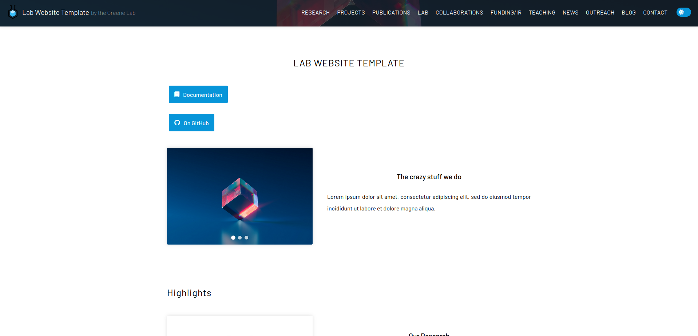

Dark mode:

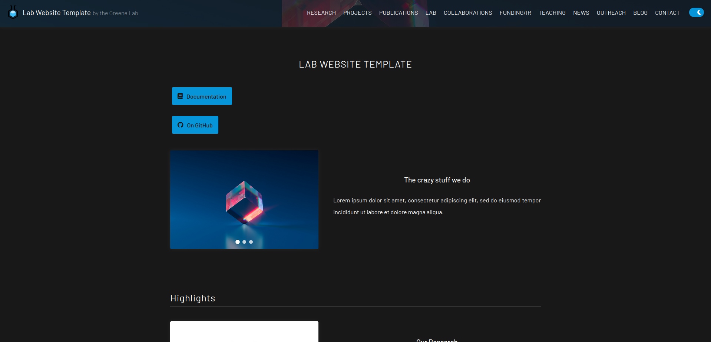

---

### Paper pages

The template includes a dedicated paper-page layout for article-like academic pages with metadata, a table of contents, and a reading-focused layout.

Light mode:

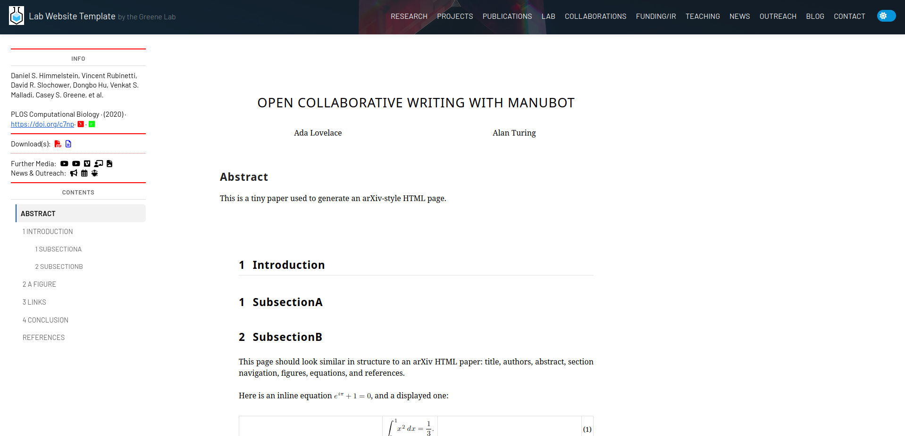

Dark mode:

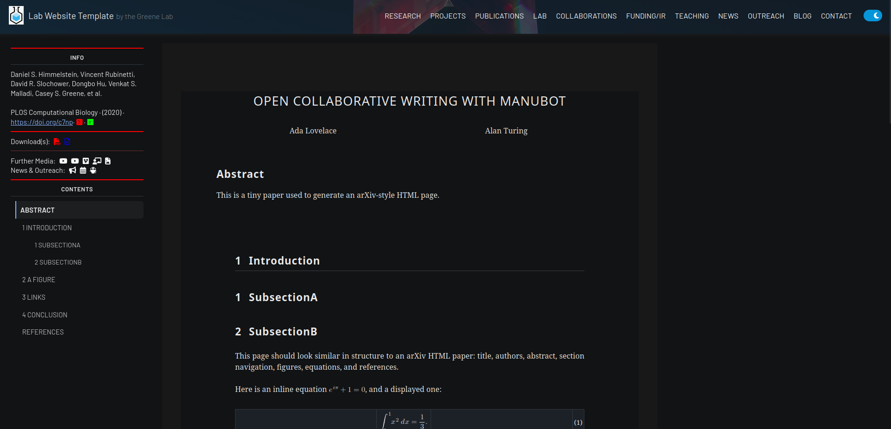

---

### Example post page

Standard article/post pages support math, metadata, and previous/next navigation.

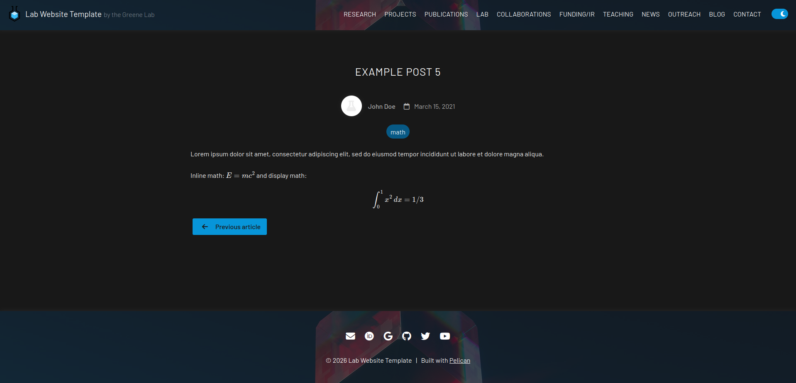

---

### News pages

The template supports section overview pages such as News, with section text, search/filter UI, and article cards.

News overview header:

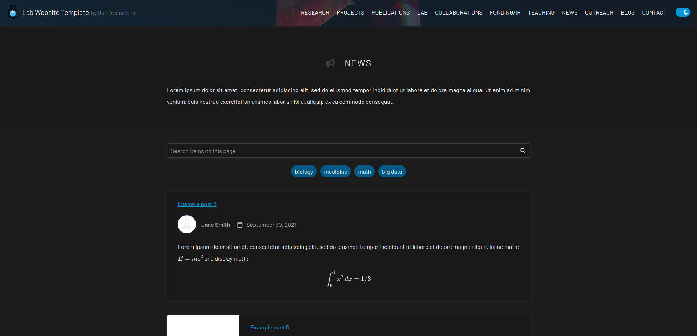

News listing:

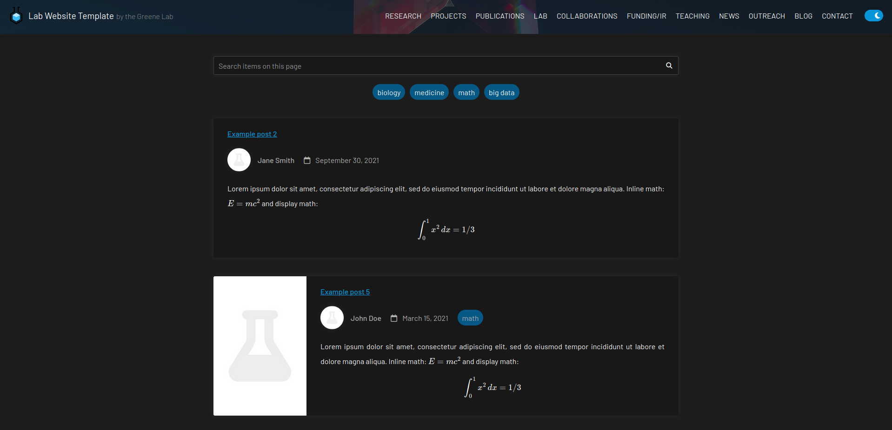

---

### Publications pages

Publication overview pages can display highlighted publications and structured citation cards.

Publications overview:

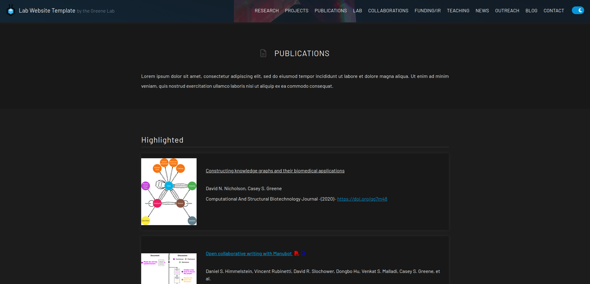

Publication list cards:

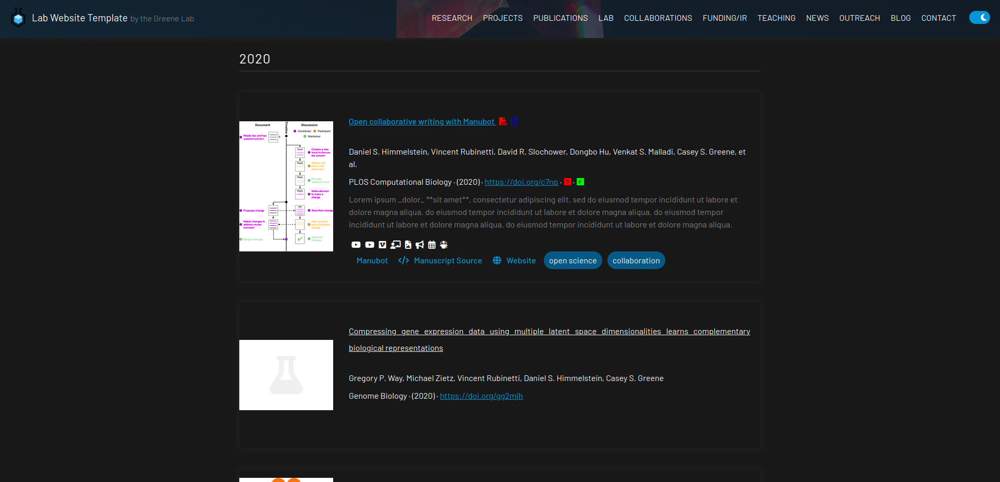

---

### Projects page

Projects can be displayed as featured cards and sectioned listings.

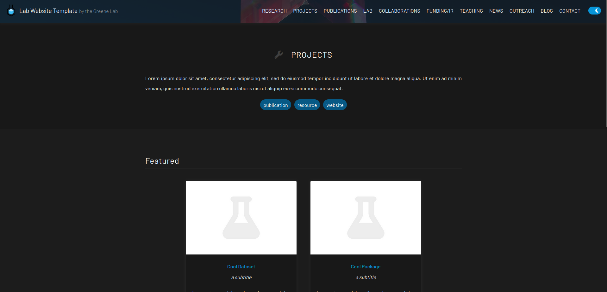

---

### Research page

A dedicated research landing page is also supported.

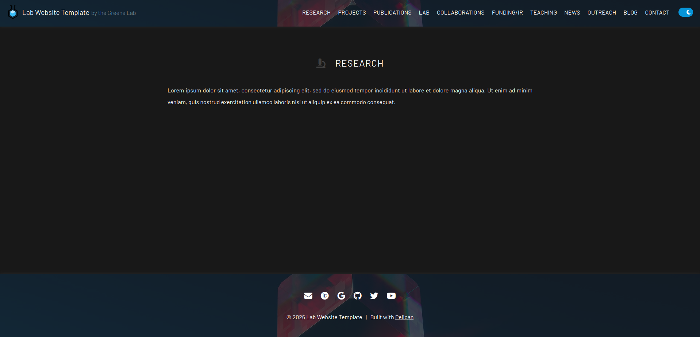

---

### Contact page

Contact pages support CTA buttons and card-based layouts.

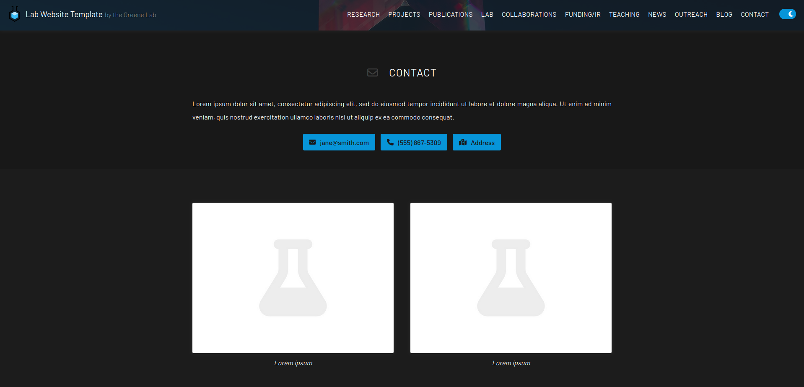

---

### Lab / team pages

The template supports lab overview pages, team listings, and nested subpages.

Lab overview:

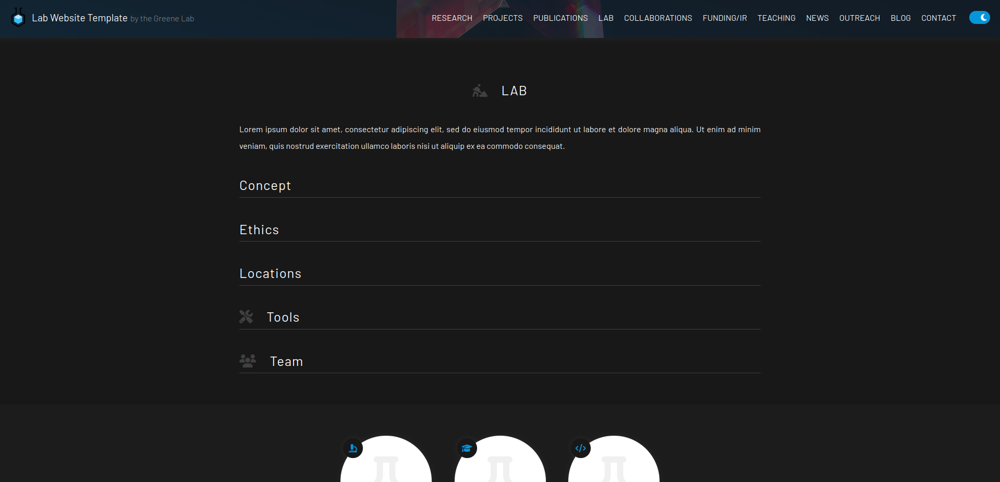

Team section inside lab pages:

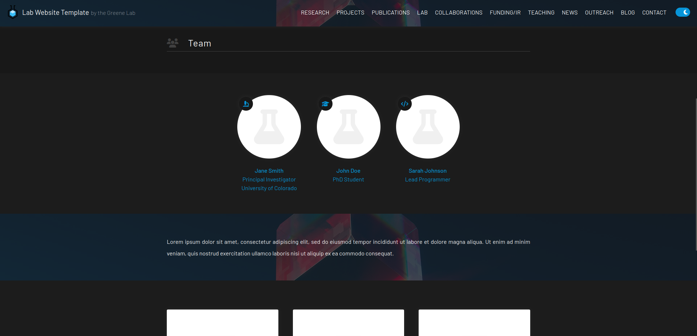

Standalone team member page:

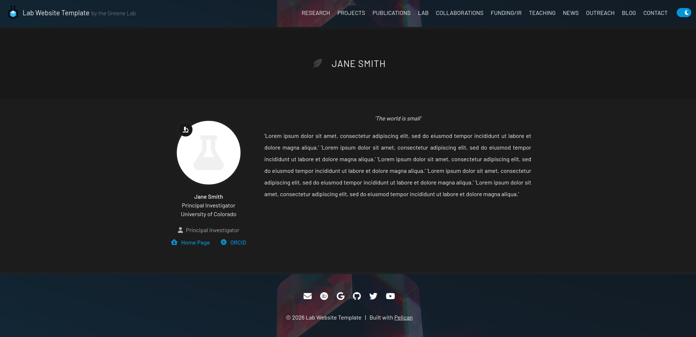
